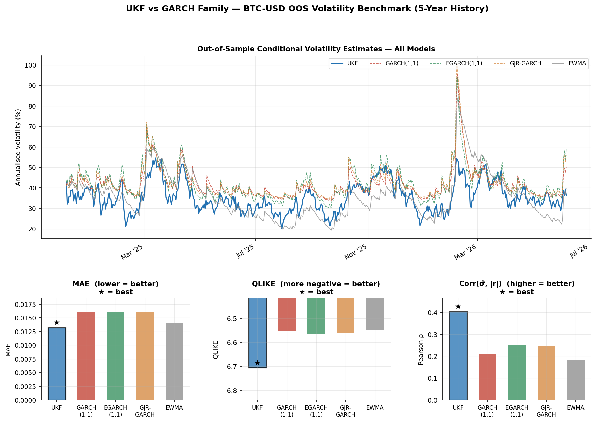

# Unscented Kalman Filter for Bitcoin Volatility

A 5-state Unscented Kalman Filter (UKF) for joint estimation of BTC return
dynamics and latent volatility. Structural parameters are fitted by Maximum
Likelihood via Harvey's (1989) Prediction Error Decomposition, and the model
is benchmarked against the GARCH family and EWMA on 5 years of live BTC-USD
data.

---

## Model

### State vector

The 5 latent states are:

| State | Symbol | Description |
|-------|--------|-------------|
| 1 | `p1` | Slow-cycle position (~30-day damped oscillator) |
| 2 | `v1` | Slow-cycle velocity |
| 3 | `p2` | Fast-cycle position (~5-day damped oscillator) |
| 4 | `v2` | Fast-cycle velocity |
| 5 | `h`  | Log-variance AR(1) — latent stochastic volatility |

### State transition

Each oscillator evolves as a damped harmonic:

```
[p_t]   = A(w, z) * [p_{t-1}]      A(w, z) = exp(-zw) * [ cos(wd)      sin(wd)/wd ]
[v_t]               [v_{t-1}]                             [ -wd*sin(wd)  cos(wd)    ]
```

where `wd = w*sqrt(1-z^2)` is the damped natural frequency and `z` is the
damping ratio.

Log-variance follows a stationary AR(1):

```
h_t = mu_h + phi*(h_{t-1} - mu_h) + w_h,    w_h ~ N(0, sigma_h^2)
```

### Dual-observation design

A single observation (log-return) leaves the log-variance state
unidentifiable. The observation vector is augmented with a realised-variance
proxy using the Harvey-Ruiz-Shephard (1994) log-linearisation:

```
z1  =  p1 + p2 + eps_t,          eps_t ~ N(0, exp(h_t))      [return]
z2  =  log(r_t^2) ~ h_t - 1.27 + eta_t,  eta_t ~ N(0, pi^2/2) [log realised var]
```

This gives the filter an independent signal on `h_t`, restoring
identifiability without requiring intraday data.

### MLE parameter fitting

Structural parameters `(T_slow, zeta_slow, T_fast, zeta_fast, phi, log_qh)`
are estimated by maximising the exact log-likelihood using Harvey's Prediction
Error Decomposition (PED). Each innovation and its covariance are produced by
the filter itself, making the likelihood tractable and exact for a linear
Gaussian model (and an excellent approximation here). Optimisation uses
L-BFGS-B; standard errors come from the numerical Hessian.

**Fitted parameters on 5-year BTC-USD history (1,826 observations):**

| Parameter | MLE estimate | 95% CI |
|-----------|-------------|--------|
| T_slow (days) | 28.9 | [23.8, 34.1] |
| zeta_slow (damping) | 0.950 | — (boundary) |
| T_fast (days) | 5.1 | [3.3, 6.8] |
| zeta_fast (damping) | 0.284 | [0.048, 0.519] |
| phi (vol persistence) | 0.949 | [0.933, 0.964] |
| log q_h | -2.69 | [-3.12, -2.26] |

The 28.9-day and 5.1-day cycles are the data's answer to *"what are the
dominant periodicities in BTC returns?"*, extracted from first principles.

---

## Results

All metrics are computed out-of-sample on the final 30% of the sample
(~548 trading days).

### OOS forecast accuracy vs GARCH benchmark

| Model | MAE | QLIKE | Corr(sigma, \|r\|) |
|-------|-----|-------|-------------------|
| **UKF** | **0.0132** | **-6.707** | **0.403** * |
| EGARCH(1,1) | 0.0161 | -6.564 | 0.251 |
| GJR-GARCH(1,1) | 0.0161 | -6.561 | 0.246 |
| GARCH(1,1) | 0.0160 | -6.551 | 0.210 |
| EWMA (lambda=0.94) | 0.0140 | -6.548 | 0.182 |

MAE lower is better; QLIKE more negative is better; Corr higher is better.
`*` = best in class. Results from `python benchmark_garch.py` on 5-year live data.

The UKF's correlation advantage is most striking: **0.40 vs 0.25 (EGARCH)**
— the state-space decomposition tracks vol regime shifts that GARCH one-step
updating consistently lags behind.

### Plots

**Price history, UKF volatility estimate, and standardised innovations**


**Return confidence bands and OOS forecast vs realised scatter**


**Innovation diagnostics — QQ, ACF, ARCH test**


**GARCH benchmark comparison**



---

## Model comparison notes

### Student-t observation noise (VB filter)

A variational-Bayes extension replacing Gaussian observation noise with a
Student-t was implemented (`run_student_t_filter` in `btc_modal.py`) and
evaluated via grid search over nu in {3, ..., 15}.

**Finding:** The VB approach worsened all OOS metrics. Innovation kurtosis
*increased* from 4.68 to 6.13 (optimal nu = 15). The reason: BTC fat tails
arise from genuine volatility regime shifts, not measurement noise. The VB
mechanism treats outliers as noise and downweights them, preventing the filter
from updating the log-variance state during the most informative observations.

The correction belongs in the **process noise** (Student-t transitions on
`h_t`) or in an explicit jump component — not the observation model.
See `compare_models.py` for the full comparison.

---

## Repository structure

```
├── btc_modal.py          # 5-state UKF: Gaussian + Student-t VB filter
├── mle_ped.py            # MLE via prediction error decomposition
├── benchmark_garch.py    # GARCH(1,1), EGARCH, GJR-GARCH vs UKF benchmark
├── compare_models.py     # Gaussian vs Student-t UKF comparison
├── make_plots.py         # Regenerate all publication plots from live data
├── data_loader.py        # yfinance download or synthetic data (USE_REAL_DATA toggle)
├── ukf_bitcoin_mle.ipynb # Self-contained notebook
├── plots/                # Generated figures
└── requirements.txt
```

---

## Setup

```bash
pip install -r requirements.txt
```

**Run the filter and base evaluation:**
```bash
python btc_modal.py
```

**Run MLE parameter fitting** (slower — optimisation + Hessian):
```bash
python mle_ped.py
```

**Run GARCH benchmark:**
```bash
python benchmark_garch.py
```

**Regenerate all plots from live data:**
```bash
python make_plots.py
```

**Run the notebook:**
```bash
jupyter notebook ukf_bitcoin_mle.ipynb
```

### Data toggle

`data_loader.py` defaults to `USE_REAL_DATA = True`, downloading the last
5 years of BTC-USD daily closes from Yahoo Finance via `yfinance`. Set
`USE_REAL_DATA = False` to use a synthetic series (calibrated to BTC empirics,
seeded for reproducibility) — useful for fast iteration when developing the
model.

---

## Design decisions

| Choice | Rationale |
|--------|-----------|
| UKF over EKF | No Jacobian required; better accuracy for the log-variance nonlinearity |
| Log-variance state | Positivity guaranteed without constrained optimisation |
| Dual observation | Resolves rank-deficiency in the observation mapping |
| Damped oscillator | Parsimonious autocorrelation structure; MLE-fitted periods are interpretable |
| PED MLE | Exact likelihood for state-space models; analytical standard errors via Hessian |
| EWMA + GARCH benchmarks | Industry-standard baselines; positions the UKF in a familiar context |

---

## Requirements

Python 3.9+

```
pip install -r requirements.txt
```

Dependencies: `filterpy`, `numpy`, `scipy`, `matplotlib`, `yfinance`, `arch`, `jupyter`

---

## Background

Built as part of a personal research project exploring state-space methods in
crypto markets. The identifiability issue and its dual-observation fix are
discussed in detail in the notebook. The GARCH benchmark and Student-t
comparison were added to give the model honest quantitative context.
