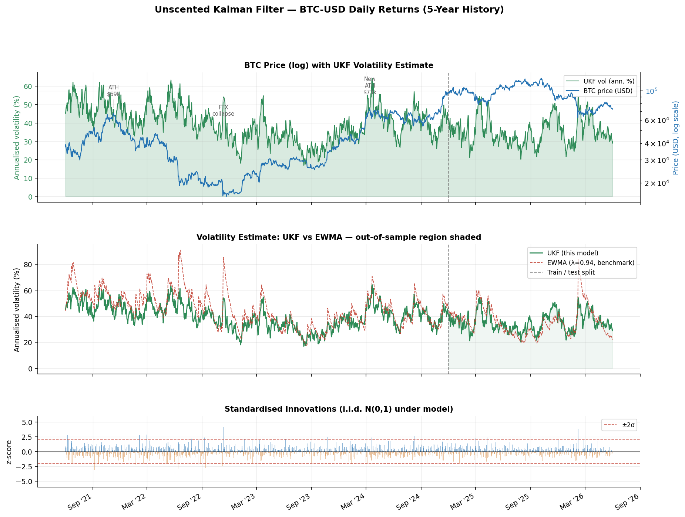
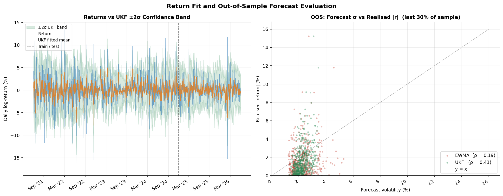
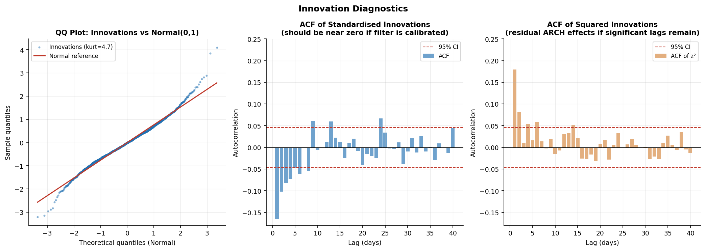

# Unscented Kalman Filter Applied to Bitcoin Returns

A 5-state Unscented Kalman Filter (UKF) for joint estimation of Bitcoin price
dynamics and latent volatility, implemented from scratch in Python.

## Model Overview

The state vector combines two components:

- **Damped oscillator** (4 states): two coupled damped oscillators capturing
  mean-reverting cyclical dynamics in log-returns, a slow cycle (~30d) and a
  fast cycle (~5d), each with a position and velocity state
- **Stochastic log-variance** (1 state): models time-varying volatility as a
  latent AR(1) process in log space, approximating a discrete-time stochastic
  volatility model

### Dual-Observation Fix

The original single-observation design suffered from latent state
unobservability, the log-variance state was not identifiable from price data
alone. This was resolved by augmenting the observation vector with a realised-
variance proxy (rolling squared returns), giving the filter an independent
signal on the volatility state and restoring identifiability.

The second observation follows the Harvey–Ruiz–Shephard (1994) log-
linearisation:

```
z1 = p1 + p2 + ε_t,    ε_t ~ N(0, exp(h_t))
z2 = log(r_t²) ≈ h_t − 1.27 + η_t,   η_t ~ N(0, π²/2)
```

### MLE Parameter Fitting

Structural parameters are estimated via Maximum Likelihood using Harvey's
(1989) Prediction Error Decomposition (PED). The filter's innovations and
their covariances define an exact log-likelihood, optimised with L-BFGS-B.
Standard errors are recovered from the numerical Hessian.

The fitted oscillator periods are interpretable: they are the data's answer to
*"what are the dominant cycles in BTC returns?"*, extracted from first
principles.

## Results

The filter produces smooth estimates of latent volatility that lead realised
volatility during high-turbulence periods, consistent with the model's
forward-looking state propagation. Plots are generated from live BTC-USD data
(5-year history, 1,826 daily observations).

### Price history and volatility estimate



### Return fit with ±2σ confidence bands and OOS evaluation



### Innovation diagnostics (QQ plot, ACF, ARCH test)



## Repository Structure

```
├── btc_modal.py          # 5-state UKF: filter pass, OOS evaluation, plots
├── mle_ped.py            # MLE via prediction error decomposition
├── data_loader.py        # Data loading: simulated or live BTC-USD via yfinance
├── ukf_bitcoin_mle.ipynb # Self-contained notebook combining both scripts
├── plots/                # Generated figures (vol_comparison.png, mle_fit.png)
└── requirements.txt
```

## Setup

```bash
pip install -r requirements.txt
```

**Run the filter:**
```bash
python btc_modal.py
```

**Run MLE fitting** (slower — optimisation + Hessian computation):
```bash
python mle_ped.py
```

**Run the notebook:**
```bash
jupyter notebook ukf_bitcoin_mle.ipynb
```

## Using Real BTC-USD Data

By default the scripts use a synthetic return series calibrated to BTC
empirics (daily sigma ~3.5%, vol persistence ~0.95, mild negative skew).
To switch to live data, open `data_loader.py` and set:

```python
USE_REAL_DATA = True
```

This downloads the last 5 years of BTC-USD daily prices from Yahoo Finance
via `yfinance` and computes log-returns. The filter and MLE code are
identical: the only difference is the absence of a `h_true` ground-truth
series (unavailable for real data), so the "True vol" line is omitted from
plots.

## Key Design Choices

| Choice | Rationale |
|--------|-----------|
| UKF over EKF | Avoids Jacobian computation; better for nonlinear log-variance dynamics |
| Log-variance state | Ensures positivity without constrained optimisation |
| Dual observation | Resolves rank-deficiency in observation mapping |
| Damped oscillator | Parsimonious way to capture autocorrelation in BTC returns |
| PED MLE | Exact likelihood for state-space models; interpretable fitted periods |

## Requirements

Python 3.9+, NumPy, SciPy, Pandas, Matplotlib, filterpy, yfinance, Jupyter

```
pip install -r requirements.txt
```

## Background

Built as part of a personal research project exploring state-space methods in
crypto markets. The identifiability issue and its fix are discussed in detail
in the notebook.
